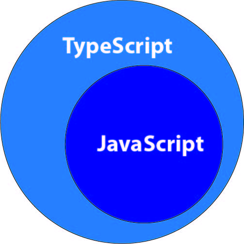

# TypeScript

> Buat mempersingkat TypeScript = TS dan JavaScript = JS

TS merupakan **superset** dari JS yang di ***compile*** ke JS. ***Superset*** disini maksudnya apa ? Maksudnya itu merupakan basis dari JS yang artinya kita dapat menggunakan semua fungsi dari JS itu sendiri dan dengan tambahan fungsi yang tidak dimiliki oleh JS. Kalau digambarkan menggunakan diagram Venn itu seperti ini.

    

